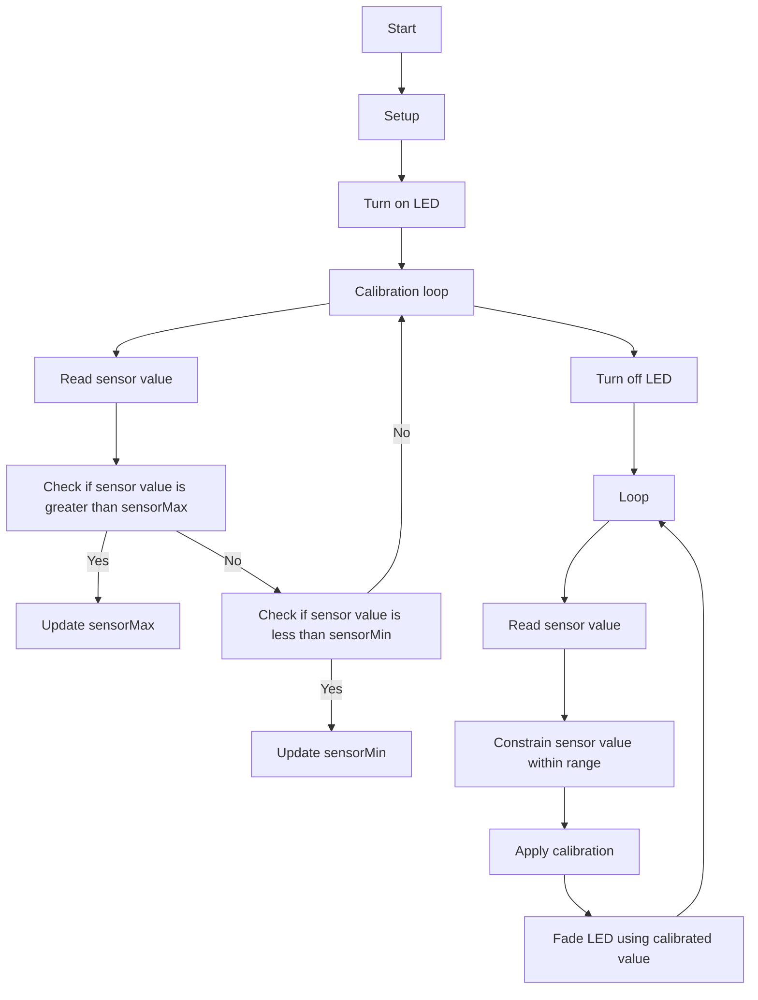

# Calibration using an Analog Sensor

This code demonstrates one technique for calibrating sensor input. The sensor readings during the first five seconds of the sketch execution define the minimum and maximum of expected values attached to the sensor pin. The sensor minimum and maximum initial values may seem backwards. Initially, you set the minimum high and listen for anything lower, saving it as the new minimum. Likewise, you set the maximum low and listen for anything higher as the new maximum.

## Circuit
- Analog sensor (potentiometer will do) attached to analog input 0
- LED attached from digital pin 9 to ground through 220 ohm resistor

## Usage
1. Upload the code to an Arduino board
2. Connect the circuit as described above
3. The built-in LED on pin 13 will turn on for 5 seconds indicating the start of the calibration period.
4. The minimum and maximum sensor values will be recorded during this time.
5. The built-in LED will turn off indicating the end of the calibration period.
6. The sensor value will be read in the `loop()` function and constrained to the calibrated minimum and maximum values.
7. The calibrated sensor value will be mapped to a value between 0 and 255 and used to control the brightness of the LED on pin 9.

## Flowchart 

## Note
- The `constrain(sensorValue, sensorMin, sensorMax)` function is used to ensure that the sensor value is within the calibrated range.
- The `map(sensorValue, sensorMin, sensorMax, 0, 255)` function is used to map the calibrated sensor value to a value between 0 and 255.
- The `analogWrite(ledPin, sensorValue)` function is used to control the brightness of the LED on pin 9 using the mapped sensor value.
- The `millis()` function is used to measure the time elapsed during the calibration period.

