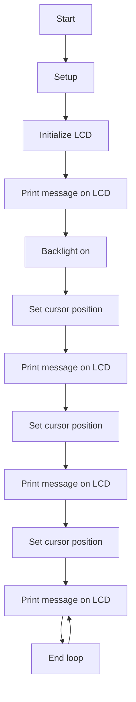

# Using a Liquid Crystal Display (LCD) with I2C

This code demonstrates how to use the LiquidCrystal_I2C library to communicate with an LCD display using I2C communication.

## Hardware Requirements
- LCD display with I2C interface
- I2C capable Arduino board

## Library
This code uses the LiquidCrystal_I2C library, which can be downloaded from the Arduino IDE library manager.

## Usage
1. Upload the code to an Arduino board
2. Connect the LCD display to the board using the I2C interface
3. The code will initialize the LCD and set the cursor to various positions to print a message "Hello, world! Ywrobot Arduino! Arduino LCM IIC 2004 Power By Ec-yuan!"

## Flowchart 

## Note
- The `lcd.init();` function is used to initialize the LCD.
- The `lcd.backlight();` function is used to turn on the backlight of the LCD.
- The `lcd.setCursor(x,y);` function is used to set the cursor position on the LCD where x is the column and y is the row.
- The `lcd.print("text");` function is used to print text on the LCD at the current cursor position.
