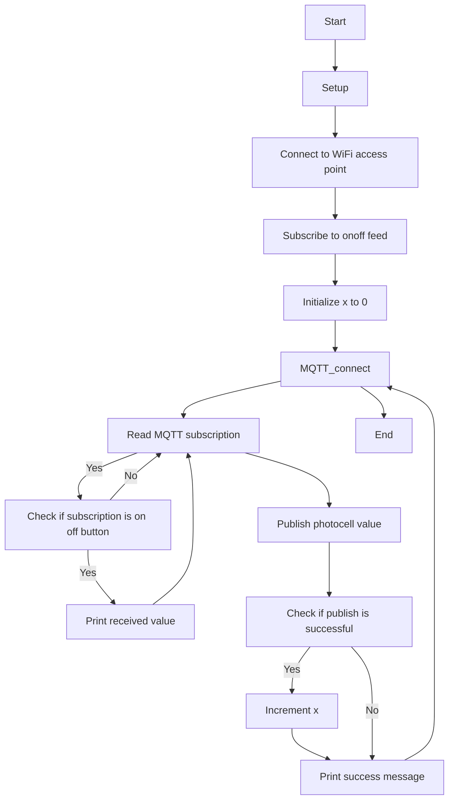

# Adafruit MQTT Library ESP8266 Example
This code is an example of how to use the Adafruit MQTT Library with the ESP8266 board. It uses the ESP8266 Arduino library, the Adafruit MQTT library, and the Adafruit MQTT client library to connect to the Adafruit IO server and send/receive data.

## Hardware Requirements
- ESP8266 board (such as the Huzzah ESP or Feather ESP8266)
- WiFi connection

## Adafruit.io Setup
- Replace `...your SSID...` with your WiFi SSID
- Replace `...your password...` with your WiFi password
- Replace `...your AIO username (see https://accounts.adafruit.com)...` with your Adafruit IO username
- Replace `...your AIO key...` with your Adafruit IO key

## Usage
1. Upload the code to the ESP8266 board
2. Open the serial monitor to see the connection status and data being sent/received
3. The code sets up a feed called 'photocell' for publishing and a feed called 'onoff' for subscribing to changes
4. The code uses the `MQTT_connect()` function to ensure a connection to the MQTT server and automatically reconnect when disconnected
5. The code uses the `loop()` function to read any incoming subscription packets and take appropriate actions

## Flowchart 

