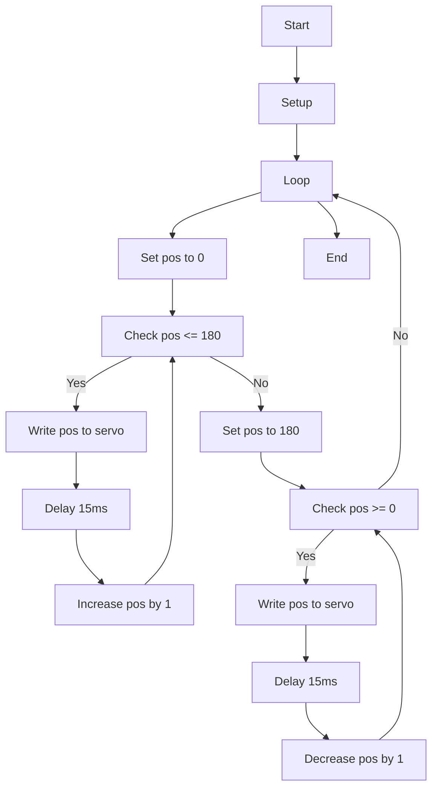

# Servo Control

## general

This code uses the Servo library to control a servo connected to GIO2 on an Arduino board. The code creates a Servo object and attaches it to GIO2 in the `setup()` function.

In the `loop()` function, the code uses two for loops to move the servo from 0 degrees to 180 degrees and then back to 0 degrees in steps of 1 degree. The `myservo.write(pos)` function is used to set the position of the servo, and `delay(15)` is used to wait for the servo to reach the desired position before moving to the next position.

This code can be used as a starting point for more advanced projects involving servo control.

Here is a more detailed explanation:

- The code starts by including the Servo library, which provides functions and constants for controlling servos.
- A `Servo` object named `myservo` is then created. This object can be used to control a servo.
- In the `setup()` function, the `myservo.attach(2)` function is called. This function attaches the servo to the GIO2 pin on the Arduino board. This means that the servo's control wire should be connected to GIO2 on the board.
- The `loop()` function contains two for loops.
    - The first loop uses the `for (pos = 0; pos <= 180; pos += 1)` statement to increment the `pos` variable from 0 to 180 in steps of 1. For each value of `pos`, the `myservo.write(pos)` function is called to set the position of the servo. The `delay(15)` function is then called to wait for 15 milliseconds, allowing the servo to move to the desired position.
    - The second for loop uses the `for (pos = 180; pos >= 0; pos -= 1)` statement to decrement the `pos` variable from 180 to 0 in steps of 1. The same `myservo.write(pos)` and `delay(15)` statements are used to set the servo's position and wait for it to move.

## flowchart 

## note

- This code causes the servo to move from 0 to 180 degrees and back to 0 degrees repeatedly. The delay of 15 milliseconds is added to give the servo time to move to the desired position.
- It is worth noting that Arduino boards have limitations on how many servo object can be created at once, so the number of servos that can be controlled in a single sketch may vary depending on the board used.
